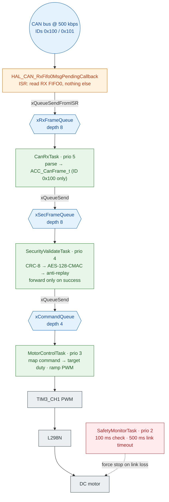
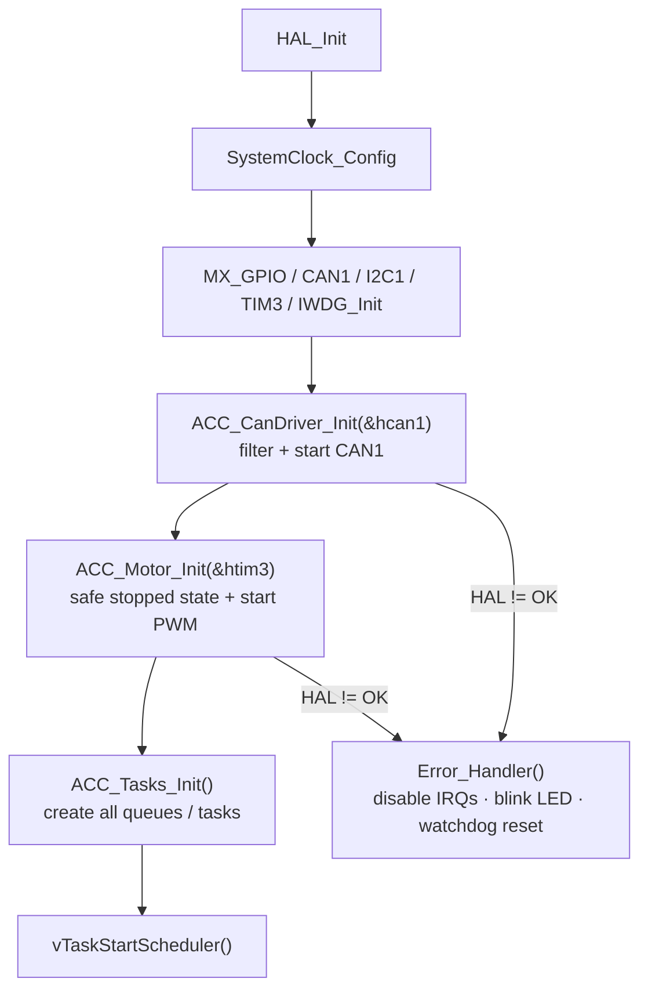

# ACC_Actuator Node

Firmware for the **Actuator Node** ("Board B") of a two-board Adaptive Cruise
Control (ACC) prototype. This board receives security-protected CAN frames from
the Sensor Node ("Board A") on a 500 kbps standard CAN bus, authenticates and
validates every frame, then drives an L298N DC-motor throttle through a ramped
TIM3 PWM output — with a watchdog-backed fail-safe that stops the motor the
moment the secure link is lost.

The protocol and behaviour described here follow the same project PRD as the
Sensor Node; the relevant sections are referenced inline throughout the code as
`PRD §x.y`.

---

## Table of contents

- [Hardware requirements](#hardware-requirements)
- [Pin mapping](#pin-mapping)
- [How it works (data flow)](#how-it-works-data-flow)
- [FreeRTOS tasks](#freertos-tasks)
- [CAN protocol](#can-protocol)
- [Security validation pipeline](#security-validation-pipeline)
- [Motor control](#motor-control)
- [Fail-safe behaviour](#fail-safe-behaviour)
- [Source layout](#source-layout)
- [Building and flashing](#building-and-flashing)
- [Security note (PSK)](#security-note-psk)
- [Design decisions worth knowing](#design-decisions-worth-knowing)

---

## Hardware requirements

| Component          | Details                                              |
|--------------------|------------------------------------------------------|
| MCU                | STM32F407VGTx (STM32F4 family, ARM Cortex-M4F)       |
| Motor driver       | L298N dual H-bridge (direction + PWM speed)          |
| Display            | SH1106 128x64 OLED (I2C), rendered with u8g2         |
| CAN                | CAN1, 500 kbps, standard 11-bit IDs                  |
| Status LED         | Onboard LED on PD13                                  |
| Watchdog           | IWDG (~1 s timeout)                                  |
| RTOS               | FreeRTOS (75 KB heap, 6 priority levels)             |

Peripherals configured via CubeMX (see `ACC_Actuator.ioc`): GPIO, CAN1, I2C1,
IWDG, TIM3 (PWM generation) and TIM1 (HAL time base). The application code lives
in `Core/` and is written on top of the STM32 HAL, FreeRTOS, u8g2 and mbedTLS.

---

## Pin mapping

| Signal          | Pin   | Function                             |
|-----------------|-------|--------------------------------------|
| Motor PWM       | PA6   | TIM3_CH1, PWM generation (ARR 999)   |
| Motor IN1       | PB0   | L298N direction control              |
| Motor IN2       | PB1   | L298N direction control              |
| Status LED      | PD13  | Push-pull output (health blink)      |
| I2C1 (OLED)     | I2C1  | 400 kHz, SH1106 via u8g2             |
| CAN1            | CAN1  | 500 kbps standard frame              |
| IWDG            | —     | Prescaler 32, reload 1000            |

---

## How it works (data flow)



Interleaved diagnostic / safety tasks:

- **[SafetyMonitorTask]** prio 2 — every 100 ms checks that a *valid* frame
  arrived within the last 500 ms; on link loss it force-stops the motor and
  refreshes the IWDG (the sole IWDG refresher).
- **[LedStatusTask]** prio 1 — distinct blink pattern per health state
  (healthy / link lost / security fault).
- **[DisplayTask]** prio 1 — redraws the u8g2 status screen from the latest
  display snapshot every 200 ms.

Synchronisation objects (all created in `ACC_Tasks_Init`):

| Object            | Type       | Depth | Element                       |
|-------------------|------------|-------|-------------------------------|
| `xRxFrameQueue`   | queue      | 8     | `ACC_RawFrame_t`              |
| `xSecFrameQueue`  | queue      | 8     | `ACC_CanFrame_t`              |
| `xCommandQueue`   | queue      | 4     | `ACC_Command_t`               |
| `xDisplayMailbox` | mailbox    | 1     | `ACC_DisplaySnapshot_t`       |

---

## FreeRTOS tasks

Priorities: higher number = higher priority (`configMAX_PRIORITIES` is 6).

| Task                       | Prio | Stack (words) | Period / trigger          | Purpose                                   |
|----------------------------|------|---------------|---------------------------|-------------------------------------------|
| `CanRxTask`                | 5    | 256           | on frame                  | Drain ISR queue, parse + hand off frames  |
| `SecurityValidateTask`     | 4    | 384           | on frame                  | CRC-8 -> CMAC -> anti-replay validation   |
| `MotorControlTask`         | 3    | 256           | 50 ms                     | Ramp PWM duty toward validated target     |
| `SafetyMonitorTask`        | 2    | 128           | 100 ms                    | Link-timeout fail-safe + IWDG refresh     |
| `LedStatusTask`            | 1    | 128           | 200 ms                    | Health blink pattern                      |
| `DisplayTask`              | 1    | 512           | 200 ms                    | u8g2 OLED snapshot render                 |

---

## CAN protocol

### Frame layout

ID `0x100`, DLC 8, standard frame, Sensor -> Actuator (this node receives it).

| Byte | Name        | Meaning                                        |
|------|-------------|------------------------------------------------|
| 0    | `command`   | `ACC_Command_t` enum value                     |
| 1    | `distance_cm`| Measured distance, clamped to 0-100           |
| 2    | `counter`   | 8-bit rolling monotonic counter, wraps 255->0  |
| 3    | `crc8`      | CRC-8 (poly 0x07, init 0xFF) over bytes 0-2    |
| 4-7  | `mac[4]`    | First 4 bytes of AES-128-CMAC over bytes 0-3   |

### CAN identifiers

| ID     | Direction                     | Status                             |
|--------|-------------------------------|------------------------------------|
| `0x100`| Sensor -> Actuator            | Data frame, received by this board |
| `0x101`| Actuator -> Sensor            | Heartbeat, reserved (not sent yet) |

Unlike the Sensor Node's accept-all filter, `ACC_CanDriver_Init()` installs an
**explicit two-ID list filter** (bank 0, list mode, 32-bit scale) so only
`0x100`/`0x101` ever reach the RX0 interrupt — less ISR load and better hygiene.

---

## Security validation pipeline

The `SecurityValidateTask` runs every received frame through three checks, in
strict order (PRD §2.3-2.5), using `can_security.c`:

1. **CRC-8** (poly `0x07`, init `0xFF`, no reflection) over
   `[command, distance_cm, counter]` — a cheap corruption filter, not a
   security check. Mismatch -> `crc_fault_count++`, frame dropped.
2. **AES-128-CMAC** (RFC 4493) over `[command, distance_cm, counter, crc8]`,
   computed with **mbedTLS** and compared in constant time against the received
   4-byte MAC. Mismatch -> `mac_fault_count++`, frame dropped.
3. **Rolling counter anti-replay** — the received 8-bit counter must be
   *newer* than the last accepted counter within a forward window of 32
   (modulo-256 wraparound aware). A repeated/stale counter -> `replay_fault_count++`,
   frame dropped.

Only when all three pass is the command forwarded to the motor task and the
counter committed. Every failure increments a diagnostic counter that
`SafetyMonitorTask` polls to drive the security-fault LED/OLED indication.

> **Crypto implementation note.** The Sensor Node builds the CMAC with a
> self-contained, dependency-free FIPS-197 AES core; this board uses mbedTLS.
> Both implement RFC 4493 with the same key, parameters and truncation, so they
> interoperate bit-for-bit. Do not change the CRC-8 init value to "textbook
> SMBUS" (`0x00`) — both boards deliberately use `0xFF` (PRD §2.3).

---

## Motor control

Validated commands map to a target PWM duty on TIM3_CH1; `MotorControlTask`
advances the current duty toward the target by at most one ramp step
(`ACC_MOTOR_RAMP_STEP_PCT` = 5%) per 50 ms control tick.

| Command             | Target duty | Ramp?                 |
|---------------------|-------------|-----------------------|
| `ACC_CMD_STOP`      | 0%          | No (snaps to 0%)      |
| `ACC_CMD_DECELERATE`| 30%         | Yes                   |
| `ACC_CMD_MAINTAIN`  | 60%         | Yes                   |
| `ACC_CMD_ACCELERATE`| 90%         | Yes                   |
| `ACC_CMD_SENSOR_FAULT`| 0%        | No (snaps to 0%)      |

`ACC_CMD_STOP` and `ACC_CMD_SENSOR_FAULT` bypass the ramp entirely and call
`ACC_Motor_ForceStop()` for an immediate zero — no ramp on the way to stopping
(PRD §3.4). Motor state is guarded by a mutex because both `MotorControlTask`
and the fail-safe path (`SafetyMonitorTask`) write to it.

---

## Fail-safe behaviour

PRD §3.5 defines one fail-safe trigger: **no valid frame received within
500 ms** (`ACC_LINK_TIMEOUT_MS`). `SafetyMonitorTask` derives this from the tick
stamp of the last successfully validated frame, and any failure class shows up
the same way:

- Sensor offline / bus fault — no frames at all
- Corrupted frame — fails CRC
- Unauthenticated/injected frame — fails CMAC
- Stale or replayed frame — fails the counter check

The moment the link looks dead, the motor is force-stopped and stays stopped
until a fresh *valid* frame arrives. The IWDG is refreshed **only** by
`SafetyMonitorTask`, so if the scheduler ever stalls the watchdog resets the
part — the intended backstop against task hangs.

FreeRTOS hooks (`configCHECK_FOR_STACK_OVERFLOW = 2`) also fail in the safest
direction: a stack overflow forces the motor off directly and blinks the LED
until the IWDG resets; a malloc failure at startup traps the same way.

---

## Source layout

| File                                   | Purpose                                              |
|----------------------------------------|------------------------------------------------------|
| `Core/Inc/can_driver.h`                | Raw-frame struct, filter/init + ISR API              |
| `Core/Src/can_driver.c`                | Two-ID list filter, RX0 ISR -> `xRxFrameQueue`       |
| `Core/Inc/can_security.h`              | Shared protocol defs + CRC/CMAC/anti-replay API      |
| `Core/Src/can_security.c`              | CRC-8, mbedTLS AES-CMAC, counter freshness, pipeline |
| `Core/Inc/security_config.h`           | Shared 16-byte PSK (`ACC_PSK`)                       |
| `Core/Inc/motor_driver.h`              | L298N + TIM3 PWM defines + API                       |
| `Core/Src/motor_driver.c`              | Ramp logic, force-stop, mutex-protected state        |
| `Core/Inc/app_tasks.h`                 | Task priorities, stacks, queue depths, snapshot      |
| `Core/Src/app_tasks.c`                 | Six FreeRTOS tasks + fail-safe orchestration         |
| `Core/Inc/oled_display.h`              | u8g2 <-> HAL bridge + snapshot layout                |
| `Core/Src/oled_display.c`              | SH1106 status render via u8g2                        |
| `Core/Src/main.c`                      | CubeMX init, peripheral config, startup sequence     |
| `Middleware/FreeRTOS/`                 | FreeRTOS kernel + `FreeRTOSConfig.h`                 |
| `Middleware/u8g2/`                     | u8g2 graphics library                                |
| `Middleware/mbedtls/`                  | mbedTLS (AES-CMAC for frame authentication)           |
| `ACC_Actuator.ioc`                     | CubeMX project (regenerate peripheral init from here)|

---

## Building and flashing

1. Open **STM32CubeIDE** and import the project (workspace:
   `STM32CubeIDE/workspace_1.18.1/`).
2. Build (default configuration `Debug`).
3. Flash via the debugger (SWD) using the `ACC_Actuator Debug.launch`
   configuration.
4. Connect the hardware: L298N (IN1=PB0, IN2=PB1, PWM=PA6), OLED on I2C1,
   CAN transceiver on CAN1 with 120 Ω termination. Flash the Sensor Node first
   or keep the bus idle — this board is fail-safe, so no frames = motor stopped.

Startup sequence in `main()`:



Any init failure or FreeRTOS allocation failure calls `Error_Handler()`, which
disables interrupts and blinks the status LED until the watchdog resets the part.

---

## Security note (PSK)

`security_config.h` contains a **demo key only** — it is identical to the
Sensor Node's key by design, and the Actuator Node will reject every frame from
any board using a different key. Do not reuse it in any real product.

Before any real deployment:

```
openssl rand -hex 16
```

and keep the file out of any public repository. See the
[root project README](../README.md) for the planned SRAM-PUF-based replacement.

---

## Design decisions worth knowing

- **ISR does the absolute minimum.** `HAL_CAN_RxFifo0MsgPendingCallback` only
  drains the FIFO and posts to a queue; all parsing and crypto happens in task
  context. The queue is depth 8 to absorb bursts; if it ever fills, a frame is
  dropped rather than the ISR blocking.
- **Explicit ID filter** (list mode, `0x100`/`0x101`) instead of accept-all —
  less ISR load and no need to parse foreign frames in the driver.
- **STOP/FAULT bypass the ramp.** `ACC_Motor_SetTarget()` snap-calls
  `ACC_Motor_ForceStop()`; the motor never coasts through intermediate duties on
  the way to a stop.
- **mbedTLS for crypto.** Unlike the Sensor Node's self-contained AES core, this
  board links mbedTLS. The security API surface (`can_security.h`) is identical
  on both boards, which is what keeps them interoperable.
- **Link timeout is the single fail-safe gate.** Every security failure —
  CRC, MAC, replay, or silence — collapses into "no valid frame recently", so
  there is exactly one code path that stops the motor, with no way for a partial
  failure to leave the throttle active.
- **IWDG is refreshed only by SafetyMonitorTask**, so a stalled scheduler, a
  deadlocked task, or a hang anywhere in the chain resets the part instead of
  silently holding the throttle.
- **Stack overflow = motor off.** `vApplicationStackOverflowHook` clears the
  direction pins directly and spins until the IWDG fires, because a corrupted
  stack could otherwise propagate bad data toward the motor.
- **Display mailbox is lock-free.** Producers own disjoint snapshot fields and
  overwrite the depth-1 mailbox; `DisplayTask` reads the freshest value with a
  peek — stale reads are acceptable for a diagnostic screen.
