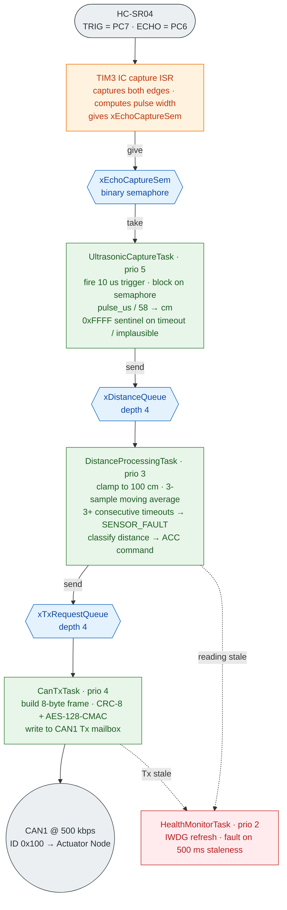
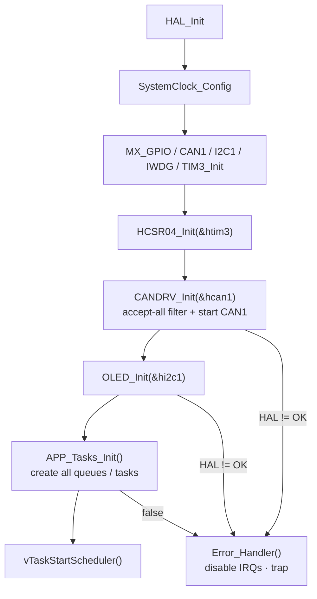

# ACC_Sensor Node

Firmware for the **Sensor Node** of a two-board Adaptive Cruise Control (ACC)
prototype. This board measures the distance to the vehicle ahead with an
HC-SR04 ultrasonic sensor, classifies that distance into an ACC command, and
broadcasts a security-protected CAN frame to the Actuator Node ("Board B") on
a 500 kbps standard CAN bus.

The protocol and behaviour described here follow a project PRD; the relevant
sections are referenced inline throughout the code as `PRD §x.y`.

---

## Table of contents

- [Hardware requirements](#hardware-requirements)
- [Pin mapping](#pin-mapping)
- [How it works (data flow)](#how-it-works-data-flow)
- [FreeRTOS tasks](#freertos-tasks)
- [CAN protocol](#can-protocol)
  - [Frame layout](#frame-layout)
  - [CAN identifiers](#can-identifiers)
  - [Security (CRC-8 + AES-128-CMAC)](#security-crc-8--aes-128-cmac)
  - [Distance thresholds and commands](#distance-thresholds-and-commands)
- [Source layout](#source-layout)
- [Building and flashing](#building-and-flashing)
- [Security note (PSK)](#security-note-psk)
- [Design decisions worth knowing](#design-decisions-worth-knowing)

---

## Hardware requirements

| Component          | Details                                              |
|--------------------|------------------------------------------------------|
| MCU                | STM32F407VGTx (STM32F4 family, ARM Cortex-M4F)       |
| Distance sensor    | HC-SR04 ultrasonic ranging module                    |
| Display            | SH1106 128x64 OLED (I2C)                             |
| CAN                | CAN1, 500 kbps, standard 11-bit IDs                  |
| Status LED         | Onboard LED on PD13                                  |
| Watchdog           | IWDG (~1 s timeout)                                  |
| RTOS               | FreeRTOS (75 KB heap, 6 priority levels)             |

Peripherals configured via CubeMX (see `ACC_Sensor.ioc`): GPIO, CAN1, I2C1,
IWDG, TIM3 (input capture) and TIM1 (HAL time base). The application code lives
in `Core/` and is written on top of the STM32 HAL and FreeRTOS.

---

## Pin mapping

| Signal          | Pin   | Function                             |
|-----------------|-------|--------------------------------------|
| HC-SR04 TRIG    | PC7   | Push-pull output, 10 us trigger pulse|
| HC-SR04 ECHO    | PC6   | Input capture on TIM3 channel 1      |
| Status LED      | PD13  | Push-pull output (health blink)      |
| I2C1 (OLED)     | I2C1  | 400 kHz, SH1106 at 8-bit addr 0x78   |
| CAN1            | CAN1  | 500 kbps standard frame              |
| IWDG            | —     | Prescaler 32, reload 1000            |

---

## How it works (data flow)



Interleaved diagnostic tasks (all best-effort):

- **[HealthMonitorTask]** prio 2 — refreshes the IWDG and flags a system fault
  if no good sensor reading or CAN Tx has occurred within 500 ms.
- **[LedStatusTask]** prio 1 — slow blink (600 ms period) when healthy, fast
  blink (200 ms) on fault.
- **[DisplayTask]** prio 1 — renders the latest snapshot to the OLED every
  200 ms.

Synchronisation objects (all created in `APP_Tasks_Init`):

| Object            | Type       | Depth | Element                       |
|-------------------|------------|-------|-------------------------------|
| `xEchoCaptureSem` | binary sem | —     | echo pulse captured           |
| `xDistanceQueue`  | queue      | 4     | `uint16_t` raw cm / sentinel  |
| `xTxRequestQueue` | queue      | 4     | `ACC_TxRequest_t`             |
| `xDisplayMailbox` | mailbox    | 1     | `ACC_DisplaySnapshot_t`       |

---

## FreeRTOS tasks

Priorities: higher number = higher priority (`configMAX_PRIORITIES` is 6).

| Task                       | Prio | Stack (words) | Period / trigger          | Purpose                                  |
|----------------------------|------|---------------|---------------------------|------------------------------------------|
| `UltrasonicCaptureTask`    | 5    | 256           | 65 ms                     | Fire HC-SR04, wait for echo, publish cm  |
| `CanTxTask`                | 4    | 384           | on request                | Build + send authenticated CAN frame     |
| `DistanceProcessingTask`   | 3    | 256           | on sample                 | Filter, clamp, classify, detect fault    |
| `HealthMonitorTask`        | 2    | 128           | 500 ms                    | IWDG refresh + staleness/fault detection |
| `LedStatusTask`            | 1    | 128           | 200 ms                    | Health blink pattern                     |
| `DisplayTask`              | 1    | 512           | 200 ms                    | OLED snapshot render                     |

---

## CAN protocol

### Frame layout

ID `0x100`, DLC 8, standard frame, Sensor -> Actuator.

| Byte | Name        | Meaning                                        |
|------|-------------|------------------------------------------------|
| 0    | `command`   | `ACC_Command_t` enum value                     |
| 1    | `distance_cm`| Measured distance, clamped to 0-100           |
| 2    | `counter`   | 8-bit rolling monotonic counter, wraps 255->0  |
| 3    | `crc8`      | CRC-8 (poly 0x07, init 0xFF) over bytes 0-2    |
| 4-7  | `mac[4]`    | First 4 bytes of AES-128-CMAC over bytes 0-3   |

The counter increments **once per transmit attempt, success or failure, and is
never reused** (PRD §2.5) — callers must not re-invoke `CANDRV_SendFrame()` to
"resend" a reading.

### CAN identifiers

| ID     | Direction                     | Status                        |
|--------|-------------------------------|-------------------------------|
| `0x100`| Sensor -> Actuator (this node)| Transmitted by this board     |
| `0x101`| Actuator -> Sensor            | Reserved, not implemented here|

`CANDRV_Init()` installs an accept-all filter (bank 0, mask mode) so either ID
can be received later if RX is ever used.

### Security (CRC-8 + AES-128-CMAC)

`can_security.c` is a self-contained, dependency-free implementation (no
mbedTLS):

- **CRC-8/SMBUS**: poly `0x07`, init `0xFF`, no reflection, over
  `[command, distance_cm, counter]`. Note: the PRD labels this "CRC-8/SMBUS"
  but specifies init `0xFF` (textbook CRC-8/SMBUS uses init `0x00`). This is
  deliberate and must match Board B exactly — do not "fix" it.
- **AES-128-CMAC**: RFC 4493, specialised for the fixed 4-byte message
  `[command, distance_cm, counter, crc8]`. FIPS-197 AES core (encrypt-only,
  which is all CMAC needs) + subkey generation (K1/K2) + truncation to the
  first 4 bytes per PRD §2.4.

Both boards must share the identical 16-byte PSK (see
[Security note](#security-note-psk)).

### Distance thresholds and commands

Readings are clamped to **100 cm** (`ACC_DIST_CLAMP_MAX_CM`), then a 3-sample
moving average is applied, then classified:

| Distance range         | Command            | Meaning                       |
|------------------------|--------------------|-------------------------------|
| `< 15 cm`              | `ACC_CMD_STOP`     | Emergency proximity stop      |
| `15 <= d < 40 cm`      | `ACC_CMD_DECELERATE`| Slow down                    |
| `40 <= d < 75 cm`      | `ACC_CMD_MAINTAIN` | Hold current speed            |
| `>= 75 cm`             | `ACC_CMD_ACCELERATE`| Accelerate toward cruise     |
| 3+ consecutive timeouts| `ACC_CMD_SENSOR_FAULT` | Sensor fault (0xFF)      |

> Thresholds were scaled to the 100 cm max (originally 30/80/150/200 for a
> 200 cm max); all four live in `can_driver.h` and are used everywhere else via
> the macros, so the OLED bar (0-100 cm mapped to 0-128 px) and the classifier
> stay consistent automatically.

---

## Source layout

| File                                   | Purpose                                              |
|----------------------------------------|------------------------------------------------------|
| `Core/Inc/can_driver.h`                | Frame layout, command enum, distance thresholds, IDs |
| `Core/Src/can_driver.c`                | CAN filter/init + frame build/transmit               |
| `Core/Inc/can_security.h`              | CRC-8 + CMAC API                                     |
| `Core/Src/can_security.c`              | CRC-8, AES-128 (FIPS-197), AES-CMAC (RFC 4493)       |
| `Core/Inc/security_config.h`           | Shared 16-byte PSK (`ACC_PSK`)                       |
| `Core/Inc/hcsr04_driver.h`             | HC-SR04 driver defines + API                         |
| `Core/Src/hcsr04_driver.c`             | DWT-us delay, trigger, TIM3 both-edges echo capture  |
| `Core/Inc/app_tasks.h`                 | Task priorities, stack sizes, timing, sync objects   |
| `Core/Src/app_tasks.c`                 | Six FreeRTOS tasks + queue/mailbox plumbing          |
| `Core/Inc/oled_display.h`              | SH1106 driver + snapshot struct + render API         |
| `Core/Src/oled_display.c`              | SH1106 init, 5x7 font, bar graph, snapshot render    |
| `Core/Src/main.c`                      | CubeMX init, peripheral config, startup sequence     |
| `Core/Src/stm32f4xx_it.c`              | ISR handlers (TIM3 -> HC-SR04 capture callback)      |
| `Middleware/FreeRTOS/`                 | FreeRTOS kernel + `FreeRTOSConfig.h`                 |
| `ACC_Sensor.ioc`                       | CubeMX project (regenerate peripheral init from here)|

---

## Building and flashing

1. Open **STM32CubeIDE** and import the project (workspace:
   `STM32CubeIDE/workspace_1.18.1/`).
2. Build (default configuration `Debug`).
3. Flash via the debugger (SWD) using the `ACC_Sensor Debug.launch`
   configuration.
4. Connect the hardware: HC-SR04 (TRIG=PC7, ECHO=PC6), OLED on I2C1,
   CAN transceiver on CAN1 with 120 Ω termination.

Startup sequence in `main()`:



Any init failure or FreeRTOS allocation failure calls `Error_Handler()`, which
disables interrupts and traps.

---

## Security note (PSK)

`security_config.h` contains a **demo key only**. Copy this exact file (or the
matching key) to the Actuator Node or its CMAC verification will never match.

Before any real deployment:

```
openssl rand -hex 16
```

and keep the file out of any public repository.

---

## Design decisions worth knowing

- **Blocking I2C from a low-priority task** (DisplayTask) is fine at the 200 ms
  refresh rate; `oled_display.c` deliberately avoids u8g2 to keep the surface
  area small — `OLED_*` is the seam to swap in u8g2 later without touching
  `app_tasks.c`.
- **Display mailbox** uses a peek-overwrite pattern with no mutex. Producers
  each own their own fields, and stale reads are acceptable for a diagnostic
  screen (documented in `app_display_mailbox_update`).
- **Stack overflow** (FreeRTOS `configCHECK_FOR_STACK_OVERFLOW=2`) traps in
  `vApplicationStackOverflowHook` rather than attempting recovery, because a
  corrupted stack can otherwise silently propagate bad data onto the CAN bus.
- **IWDG is refreshed only by HealthMonitorTask**, so if the scheduler stops,
  the watchdog resets the part — this is the intended backstop against task
  stalls.
- **Sentinel `0xFFFF`** (`APP_DISTANCE_TIMEOUT_SENTINEL`) marks a failed
  reading; `DistanceProcessingTask` suppresses bogus frames while below the
  fault threshold by continuing to publish the last known-good command.
