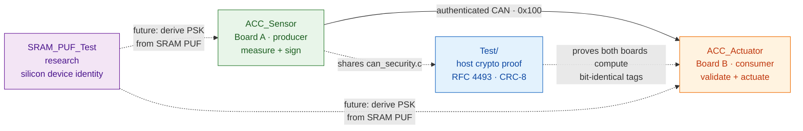
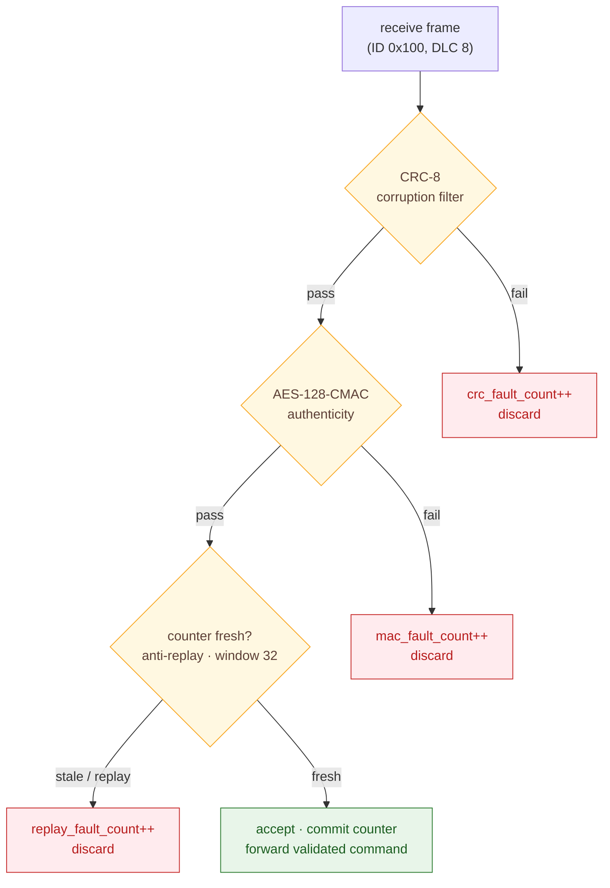

# Secure Adaptive Cruise Control (SACC)

> A security-hardened, two-node Adaptive Cruise Control prototype on the
> STM32F407 — authenticated CAN command chain, fail-safe actuation, and
> SRAM-PUF research toward hardware-derived device identity.

This repository contains the complete firmware for a scale-model adaptive
cruise control system split across two STM32F407VGTx boards. A **Sensor Node**
measures the distance to the vehicle ahead with an ultrasonic rangefinder and
broadcasts an **authenticated** cruise-control command over CAN. An **Actuator
Node** validates every frame's integrity, authenticity and freshness, then
drives a DC-motor throttle — and *fails safe* the instant the secure link is
compromised or lost.

It also ships a host-side unit test for the shared cryptographic core, and a
bare-metal experiment that captures the SRAM power-up state (an SRAM PUF) as a
step toward replacing the demo key with a device-unique secret.

---

## Table of contents

- [Why this project exists](#why-this-project-exists)
- [System architecture](#system-architecture)
- [Repository layout](#repository-layout)
- [How the pieces tie together](#how-the-pieces-tie-together)
- [The CAN security protocol](#the-can-security-protocol)
- [Fail-safe philosophy](#fail-safe-philosophy)
- [Hardware requirements](#hardware-requirements)
- [Getting started](#getting-started)
- [Security notes](#security-notes)
- [Roadmap](#roadmap)

---

## Why this project exists

Vehicle networks are a well-known attack surface — modern CAN bus designs
assume an untrusted network and authenticate every command. This project
implements that idea end-to-end on real hardware:

- **Authenticity** — every CAN frame carries an AES-128-CMAC tag; a valid tag
  is impossible to forge without the shared key.
- **Integrity** — a CRC-8 detects accidental corruption, and the CMAC covers
  it too.
- **Anti-replay** — a rolling 8-bit counter with a freshness window rejects
  captured-and-replayed frames.
- **Fail-safe actuation** — a supervisory task stops the motor the instant the
  authenticated link is lost, backed by a hardware watchdog.
- **Hardware root of trust (research)** — an SRAM-PUF experiment aims to derive
  a unique per-device key from silicon physics instead of a stored constant.

---

## System architecture

```mermaid
flowchart LR
    classDef boardA fill:#e8f5e9,stroke:#2e7d32,stroke-width:2px,color:#1b5e20
    classDef boardB fill:#fff3e0,stroke:#ef6c00,stroke-width:2px,color:#bf360c
    classDef bus    fill:#f3e5f5,stroke:#6a1b9a,stroke-width:2px,color:#4a148c
    classDef fail   fill:#ffebee,stroke:#c62828,stroke-width:1px,color:#b71c1c
    classDef plant  fill:#eceff1,stroke:#37474f,stroke-width:1px,color:#263238

    subgraph BoardA["Board A — ACC_Sensor Node (STM32F407VGTx)"]
        direction TB
        HC["HC-SR04 ultrasonic<br/>TRIG = PC7 · ECHO = PC6"]
        UC["UltrasonicCaptureTask<br/>65 ms cycle · pulse_us / 58 → cm"]
        DP["DistanceProcessingTask<br/>clamp to 100 cm · 3-sample filter · classify"]
        CT["CanTxTask<br/>build 8-byte frame · CRC-8 + AES-128-CMAC"]
        HC --> UC --> DP --> CT
    end

    BUS(("CAN1 @ 500 kbps<br/>ID 0x100 · DLC 8 · standard frame"))

    CT -- "sign & transmit" --> BUS

    subgraph BoardB["Board B — ACC_Actuator Node (STM32F407VGTx)"]
        direction TB
        RX["CanRxTask<br/>two-ID list filter · ISR drain"]
        SV["SecurityValidateTask<br/>CRC-8 → AES-128-CMAC → anti-replay"]
        MC["MotorControlTask<br/>ramped TIM3 PWM"]
        SM["SafetyMonitorTask<br/>500 ms link timeout · IWDG · fault latch"]
        RX --> SV --> MC
    end

    BUS -- "receive & verify" --> RX
    MC --> PLANT["L298N · DC motor"]
    SM -. "force stop" .-> PLANT

    class HC,UC,DP,CT boardA
    class RX,SV,MC,SM boardB
    class BUS bus
    class SM fail
    class PLANT plant
```





---

## Repository layout

| Directory           | What it is                                                      | Role                                  |
|---------------------|-----------------------------------------------------------------|---------------------------------------|
| `ACC_Sensor/`       | Board A firmware: HC-SR04 ranging + authenticated CAN TX        | *Producer* — measures & commands      |
| `ACC_Actuator/`     | Board B firmware: CAN RX + validation + ramped motor control    | *Consumer* — validates & actuates     |
| `Test/`             | Host-side unit test for `can_security.c` (RFC 4493 / CRC-8)     | *Proof* — crypto correctness          |
| `SRAM_PUF_Test/`    | Bare-metal SRAM power-up capture (CCM RAM) over UART            | *Research* — device-unique identity   |

Each STM32 project is a self-contained STM32CubeIDE workspace (`.ioc`, HAL
drivers, linker scripts and a `Debug` configuration), and links its own copy of
the shared protocol code — see below for how they stay in sync.

---

## How the pieces tie together

### The two boards speak one protocol

`can_security.h` defines the wire format, command enum, CAN IDs and security
parameters that both nodes implement bit-for-bit. The authoritative definition
lives in each project under `Core/Inc/can_security.h`:

| Byte | Name | Meaning |
|------|------|---------|
| 0 | `command` | `ACC_Command_t` (STOP / DECELERATE / MAINTAIN / ACCELERATE / SENSOR_FAULT) |
| 1 | `distance_cm` | measured distance, clamped 0-100 |
| 2 | `counter` | 8-bit rolling monotonic counter (anti-replay) |
| 3 | `crc8` | CRC-8 (poly 0x07, init 0xFF) over bytes 0-2 |
| 4-7 | `mac[4]` | truncated AES-128-CMAC over bytes 0-3 |

The Sensor signs, the Actuator verifies, and both share the identical 16-byte
PSK in `security_config.h`.

> **Implementation difference that matters:** Board A computes the CMAC with a
> self-contained, dependency-free FIPS-197 AES core (so it can be unit-tested on
> the host), while Board B uses mbedTLS. Both implement RFC 4493 with the same
> key and truncation, so they interoperate. This is a deliberate exercise in
> keeping a *protocol* independent of a *crypto library*.

### The host test proves the crypto

`Test/` compiles `can_security.c` (the Sensor's self-contained core) with plain
gcc and checks it against the official RFC 4493 test vectors plus a
PyCryptodome cross-check. Because the Actuator's mbedTLS path implements the
same spec, passing this test is the shared guarantee that both boards compute
identical tags.

### The SRAM-PUF experiment is the security roadmap

Today the PSK is a hard-coded demo constant — deliberately flagged as
production-unsafe. `SRAM_PUF_Test` captures the raw power-up state of 2 KB of
CCM RAM *before any C runtime init* (the first code to run is the reset
handler), streaming it over UART as `PUFSTART…PUFEND`. SRAM startup values are
a well-known physical unclonable function: unique per chip, stable across power
cycles. The experiment is the foundation for a follow-up that derives and
provisions a device-unique key — so the "authenticity" story no longer depends
on a value sitting in flash.

---

## The CAN security protocol

Validation order matters. The Actuator runs three checks in sequence and
discards the frame at the first failure:



The Sensor never reuses a counter value: it increments exactly once per transmit
attempt, even on failure, so a captured frame can never be replayed as "new".

Distance → command classification (scaled for a 100 cm test plank):

| Distance | Command |
|----------|---------|
| `< 15 cm` | `ACC_CMD_STOP` |
| `15 – 40 cm` | `ACC_CMD_DECELERATE` |
| `40 – 75 cm` | `ACC_CMD_MAINTAIN` |
| `>= 75 cm` | `ACC_CMD_ACCELERATE` |
| 3+ consecutive sensor timeouts | `ACC_CMD_SENSOR_FAULT` |

---

## Fail-safe philosophy

The Actuator treats *any* break in the authenticated chain as a reason to stop:

- **Link loss** — no valid frame within 500 ms force-stops the motor. Every
  failure class (silence, CRC, MAC, replay) collapses into this single gate, so
  there is one — and only one — fail-safe code path.
- **Watchdog backstop** — the IWDG is refreshed by exactly one task, so a
  stalled scheduler resets the part instead of holding the throttle.
- **Fails-in-place boot** — the motor starts in a safe stopped state and only
  moves in response to a validated command.
- **Stack-overflow hook** — a corrupted stack clears the motor pins directly
  rather than risk propagating bad state.

---

## Hardware requirements

| Component            | Details                                        |
|----------------------|------------------------------------------------|
| 2× STM32F407VGTx dev boards | (e.g. STM32F4-Discovery-class, onboard LED on PD13) |
| 1× HC-SR04 ultrasonic rangefinder | Sensor Node: TRIG=PC7, ECHO=PC6         |
| 1× L298N motor driver + DC motor | Actuator Node: PWM=PA6, IN1=PB0, IN2=PB1 |
| 1× SH1106 128x64 OLED (I2C) | Both nodes show a live status screen    |
| 2× CAN transceiver + 120 Ω termination | 500 kbps standard frame              |
| 2× ST-Link (SWD) debug probes | for flashing and debugging             |

---

## Getting started

All three STM32 projects are imported and built the same way in
**STM32CubeIDE** (workspace: `STM32CubeIDE/workspace_1.18.1/`), then flashed
via SWD using each project's `*.launch` configuration.

```text
1. Build & flash  ACC_Sensor   (Board A)
2. Build & flash  ACC_Actuator (Board B)
3. Power both boards on a shared CAN bus with 120 Ω termination
4. Move an obstacle in front of the HC-SR04 → the motor follows the command,
   and cutting the CAN link stops the motor within 500 ms
```

Verify the crypto on the host (no hardware needed):

```bash
cd Test
gcc -Wall -Wextra -std=c99 -O2 ../ACC_Sensor/Core/Src/can_security.c test_can_security.c -I ../ACC_Sensor/Core/Inc -o test_can_security
./test_can_security
```

Capture the SRAM PUF (research):

```text
1. Build & flash  SRAM_PUF_Test
2. Open a serial terminal on USART2 @ 115200 baud (PA2 = TX)
3. Power-cycle the board — the very first bytes out are the PUF frame:
   "PUFSTART" <2048 raw bytes> "PUFEND"
```

---

## Security notes

- The PSK in `security_config.h` is a **demo key only** — identical on both
  boards, so they interoperate out of the box, but do **not** deploy it.
  Regenerate with `openssl rand -hex 16` and keep it out of public repos.
- The SRAM-PUF capture is research-grade: 2 KB of CCM RAM, dumped before any
  C runtime init so the bytes are pure silicon power-up state. See
  `SRAM_PUF_Test/Core/Src/startup.c` for the ordering guarantees and the
  `STM32F407VGTX_FLASH.ld` NOLOAD section that protects it.
- The counter freshness window (32) and the 500 ms link timeout are deliberate,
  documented constants — tune them only with an understanding of the replay
  and fail-safe trade-offs.

---

## Roadmap

- [ ] Provision a device-unique key from the SRAM-PUF capture and use it to
      derive the CMAC key at boot (removing the stored PSK).
- [ ] Implement the `0x101` heartbeat (Actuator → Sensor) for bidirectional
      link health.
- [ ] Port the host test to cover the Actuator's mbedTLS path, keeping the two
      implementations cross-checked against each other.

---

## License / status

Academic/research prototype firmware. See each project's `.ioc` and header
comments for per-file licensing. Not certified for real-vehicle use.
